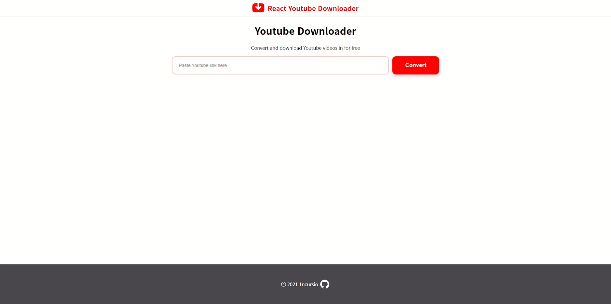

# React Youtube Downloader

</img>
A simple React app that allows you to download videos from YouTube.

## Features

- Download videos from YouTube

## Running on your machine

### Clientside

    cd client && npm install
    npm run dev

### Serverside

    cd server && npm install
    npm run dev

Now you can access the app at http://localhost:3090
